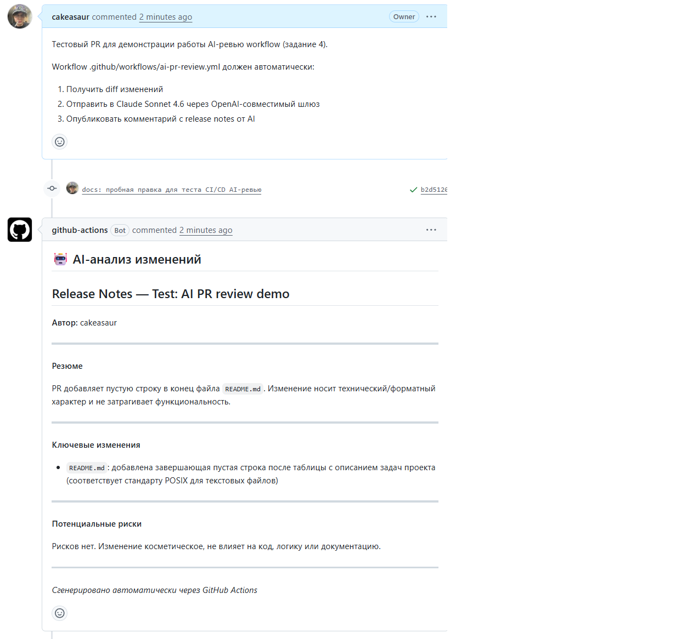

# Задание 4 — Интеграция ИИ в CI/CD

**Проект:** Сервис аренды квартир (Вариант 26)
**Workflow:** [`.github/workflows/ai-pr-review.yml`](../.github/workflows/ai-pr-review.yml)

---

## Что делает workflow

При открытии или обновлении Pull Request GitHub Actions:

1. Получает diff изменённых файлов между PR-веткой и `master` (фильтр по расширениям `.py`, `.html`, `.yml`, `.json`, `.md`, первые 12000 символов).
2. Формирует промпт на русском с просьбой написать release notes (резюме, ключевые изменения, риски).
3. Отправляет промпт в OpenAI-совместимый эндпоинт `/chat/completions` через `curl`.
4. Парсит ответ через `jq`, срезает префиксы content-фильтра шлюза, кладёт результат в `$GITHUB_OUTPUT`.
5. Публикует комментарий в PR через `actions/github-script@v7`.

## Конфигурация

| Где | Имя | Значение |
|---|---|---|
| Secret | `OPENAI_API_KEY` | API-ключ шлюза |
| Secret | `OPENAI_BASE_URL` | базовый URL шлюза, например `https://api.vibecode-claude.online/v1` |
| Variable | `OPENAI_MODEL` | имя модели, например `claude-sonnet-4.6` |

Если `OPENAI_API_KEY` не задан, workflow не падает — постит fallback-комментарий с инструкцией по настройке (см. ветку `else` в yml).

## Защита от command injection

Все значения из пользовательских полей (`PR_TITLE`, `PR_AUTHOR`, diff) попадают в shell **только через переменные окружения**, а в JSON-payload — через `jq --arg`. Прямой интерполяции `${{ github.event.pull_request.title }}` в `run:` нет — это закрыло бы дыру для PR-инъекций.

## Демонстрация работы

Для проверки workflow создан тестовый PR [#1 «Test: AI PR review demo»](https://github.com/cakeasaur/LR12_26/pull/1) с пустой правкой в `README.md`. Через ~30 секунд после открытия PR в нём появился комментарий от **github-actions[bot]** с release notes от Claude Sonnet 4.6:

Видно структуру ответа:
- Заголовок «🤖 AI-анализ изменений»
- Раздел «Резюме» — что делает PR
- Раздел «Ключевые изменения» — bullet-список
- Раздел «Потенциальные риски»
- Подпись «Сгенерировано автоматически через GitHub Actions»

## Использованные промпты

См. [PROMPT_LOG.md, раздел «Задание 4»](../PROMPT_LOG.md).
